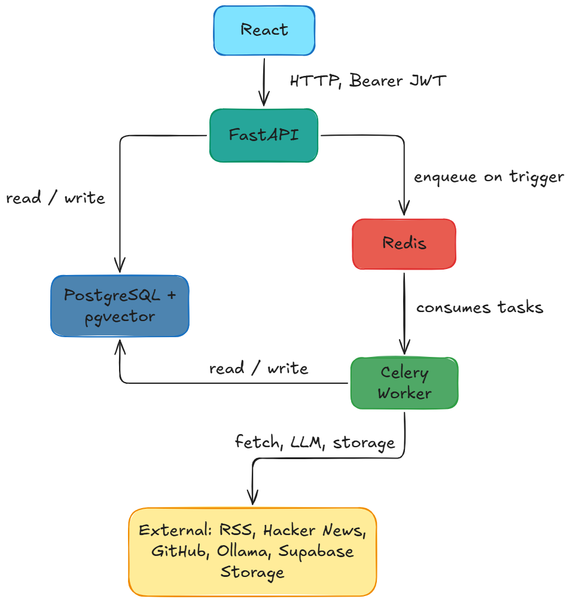

# InsightThreads Frontend

**Turn noise into narratives**

[](LICENSE)

Frontend for **InsightThreads**, a platform that ingests unstructured text from RSS, Hacker News, and GitHub, runs AI/ML pipelines, and surfaces topic clustering, sentiment analysis, trend detection, anomalies, AI-generated insights, semantic search, and 2D UMAP visualizations.

## Table of contents

- [About](#about)
- [Architecture](#architecture)
- [Features](#features)
- [Tech stack](#tech-stack)
- [Getting started](#getting-started)
- [Configuration](#configuration)
- [Project structure](#project-structure)
- [License](#license)

## About

**Problem:** Analysts and decision-makers drown in unstructured content (feeds, forums, repos). Raw data rarely reveals patterns, sentiment, or narrative threads.

**Solution:** InsightThreads ingests multiple sources, processes them through ML pipelines, and presents clusters, sentiment, trends, anomalies, and semantic search in a single dashboard. You see _what’s trending_, _how people feel_, and _where anomalies occur_, not just raw links.

**Why it matters:** One place to go from “lots of links” to “clear narratives and actionable insights” for analysts, researchers, product managers, content strategists, and technical leaders.

## Architecture



## Features

| Area                | What you get                                                                                                                                     |
| ------------------- | ------------------------------------------------------------------------------------------------------------------------------------------------ |
| **Authentication**  | Sign up, login, password reset via Supabase; JWT validated by backend                                                                            |
| **Dashboard**       | Trending clusters, recent ingestions, quick stats, semantic search entry                                                                         |
| **Ingestion**       | Trigger jobs for RSS, Hacker News, or GitHub with source-specific options; view events and status                                                |
| **Documents**       | Filter and browse documents by processed state, source, sentiment, cluster, ingest run; open detail drawer with raw text and cluster memberships |
| **Clusters**        | List ordered by trending score; detail view with keywords, timeseries (mentions, sentiment, momentum, forecast bands), insights, anomalies       |
| **Insights**        | AI-generated insight cards with confidence; filter by cluster; link to cluster                                                                   |
| **Anomalies**       | Timeline/table with filters (cluster, type, date range); severity and metadata                                                                   |
| **Semantic search** | Query documents by meaning; optional similarity threshold; results with relevance and document detail                                            |
| **UMAP**            | Global scatter (all documents) or per-cluster; color by cluster; tooltips and link to document detail                                            |

## Tech stack

| Layer          | Choice                                     |
| -------------- | ------------------------------------------ |
| Runtime        | React 19, Vite 7                           |
| Language       | TypeScript                                 |
| Styling        | Tailwind CSS 4                             |
| UI             | shadcn/ui (Radix primitives), Lucide icons |
| Data & API     | TanStack Query, REST (backend OpenAPI)     |
| Auth & storage | Supabase                                   |
| Charts         | Recharts                                   |

## Getting started

### Prerequisites

- **Node.js** 20+ (LTS recommended)
- **pnpm** (or npm / yarn)
- Running **InsightThreads backend** (API base URL required)
- **Supabase** project (for auth)

### Install

```bash
git clone https://github.com/hassnain-kazmi/insight-threads-frontend.git
cd insight-threads-frontend
pnpm install
```

### Run locally

```bash
cp .env.example .env
# Edit .env with your VITE_API_BASE_URL, VITE_SUPABASE_URL, VITE_SUPABASE_ANON_KEY

pnpm dev
```

Open [http://localhost:5173](http://localhost:5173). Sign up or log in; the app uses the backend only with a valid Supabase JWT.

### Build for production

```bash
pnpm build
pnpm preview   # optional: local preview of production build
```

## Configuration

Create a `.env` in the project root (see `.env.example`):

| Variable                 | Description                                         |
| ------------------------ | --------------------------------------------------- |
| `VITE_API_BASE_URL`      | Backend API base URL (e.g. `http://localhost:8000`) |
| `VITE_SUPABASE_URL`      | Supabase project URL                                |
| `VITE_SUPABASE_ANON_KEY` | Supabase anonymous (public) key                     |

All API requests (except `/health`) send `Authorization: Bearer <supabase_jwt>`.

## Project structure

```
insight-threads-frontend/
├── .github/
│   └── workflows/       # CI
├── docs/                # Architecture diagram
├── src/
│   ├── App.tsx          # App root, providers
│   ├── components/      # Shared UI (layout, ui primitives, feature components)
│   ├── features/        # Route-level pages (auth, dashboard, ingest, documents, clusters, insights, anomalies, umap, search)
│   ├── hooks/           # TanStack Query hooks, useDebounce, etc.
│   ├── services/        # API client, Supabase
│   ├── contexts/        # Auth context
│   ├── types/           # API and app types
│   ├── lib/             # utils, logger
│   ├── constants.ts
│   ├── routes.tsx
│   ├── main.tsx
│   └── index.css
├── package.json
├── README.md
```

## License

MIT © [Syed Hassnain Kazmi](LICENSE). See [LICENSE](LICENSE) for full text.
